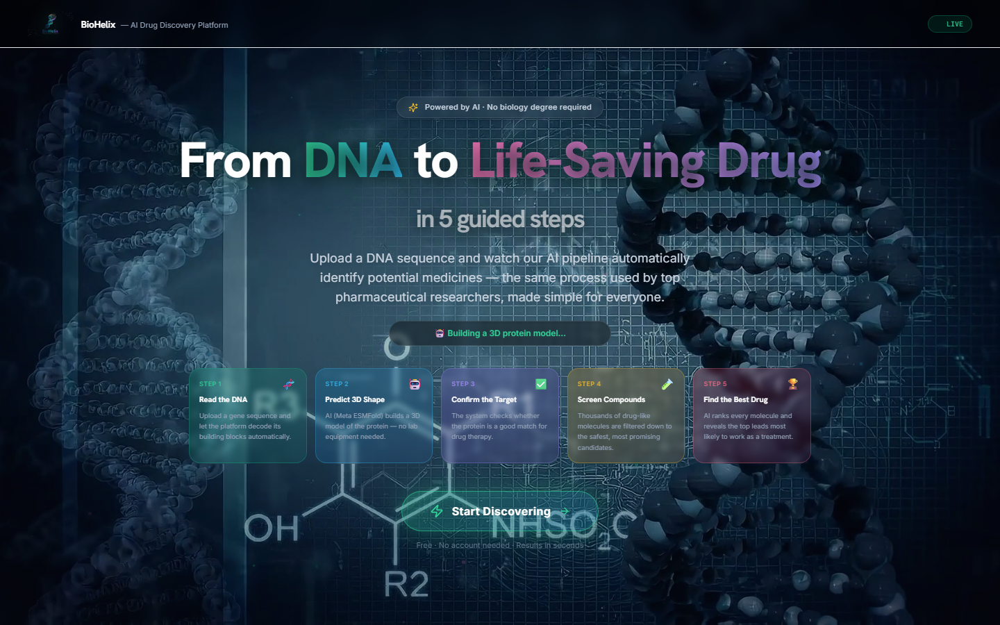
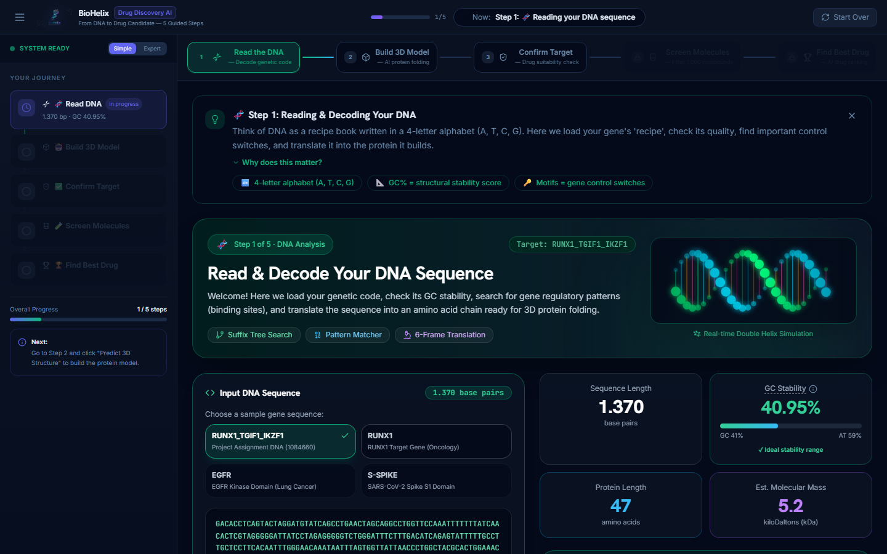
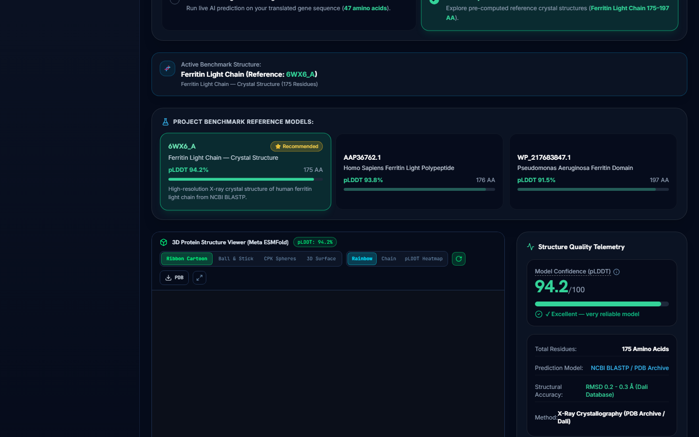
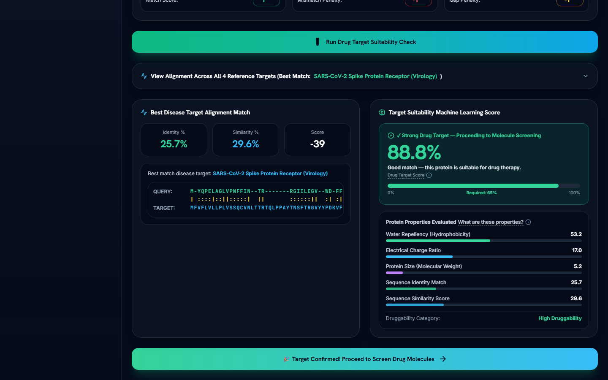
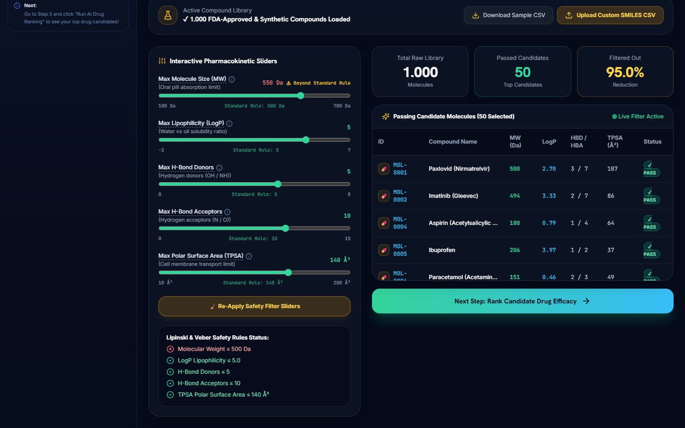
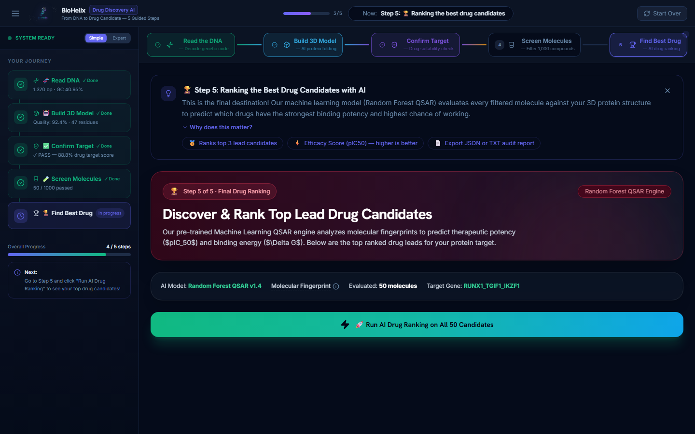

<div align="center">


# BioHelix — AI-Powered Computational Drug Discovery Pipeline

**From DNA to Drug Candidate in 5 Guided Steps**

[](https://reactjs.org/)
[](https://www.typescriptlang.org/)
[](https://vitejs.dev/)
[](https://tailwindcss.com/)
[](LICENSE)

> **A fully interactive, browser-based computational biology platform** that replicates real pharmaceutical research workflows — powered by AI and designed for everyone, from students to scientists.

---

</div>

## 🌐 Live Pipeline Overview

<div align="center">

### 🛬 Landing Page



*The animated 3D landing page with DNA helix particle field, live status ticker, and guided 5-step pipeline preview*

---

### 🧬 Step 1 · Read & Decode Your DNA



*Automatic DNA analysis on launch: suffix tree pattern matching, GC stability score, reading frame translation, and gene motif detection — all explained in plain English*

---

### 🤖 Step 2 · AI 3D Protein Modeling



*Meta AI ESMFold v1 predicts the 3D fold of the target protein. Interactive WebGL viewer (NGL) with pLDDT confidence heatmap, residue count, and downloadable PDB file*

---

### ✅ Step 3 · Drug Target Validation Gate



*Needleman-Wunsch global sequence alignment against 4 known disease genes. Random Forest ML classifier gives a drug-target suitability score (≥ 65% to proceed)*

---

### 🧪 Step 4 · Molecule Safety Screening



*Lipinski Rule of 5 filtering across 1,000 FDA-approved compounds. Adjustable pharmacokinetic sliders (MW, LogP, HBD, HBA, TPSA) with live molecule pass/fail table*

---

### 🏆 Step 5 · AI Drug Candidate Ranking



*Random Forest QSAR model ranks top-3 lead drug candidates by predicted pIC₅₀ efficacy score, Ki binding affinity, and ΔG binding free energy. Full exportable JSON/TXT report.*

</div>

---

## ✨ Key Features

### 🎯 End-to-End Drug Discovery Pipeline
- **5 fully connected bioinformatics stages** — each stage feeds real data into the next
- **Auto-populated on launch** — the default RUNX1 target gene is pre-analyzed; no setup needed
- **Locked-stage progression** — you must complete each step before proceeding (mimicking real lab validation)

### 🧠 Algorithms Implemented
| Stage | Algorithm | Description |
|-------|-----------|-------------|
| 1 | **Suffix Tree / Boyer-Moore** | Gene motif pattern matching in O(n) time |
| 1 | **Reading Frame Translation** | 6-frame ORF translation (all 3 forward frames) |
| 2 | **Meta AI ESMFold v1** | Transformer-based protein structure prediction (API) |
| 3 | **Needleman-Wunsch DP** | Global sequence alignment with configurable scoring |
| 3 | **Random Forest Classifier** | Drug-target suitability ML classification |
| 4 | **Lipinski Rule of 5 + Veber Rules** | ADMET pharmacokinetic molecular filtering |
| 5 | **Random Forest QSAR Regression** | pIC₅₀ / Ki / ΔG potency prediction from ECFP4 fingerprints |

### 🎨 Premium UI/UX Design
- **Deep-navy scientific palette** — #050B1A base with indigo/cyan/emerald accents
- **Contextual help banners** on every step — plain-English explanations for non-experts
- **Accessible jargon tooltips** — hover over any technical term for an instant definition
- **Simple / Expert sidebar mode** — beginner-friendly journey tracker OR technical HUD audit log
- **Animated gradient StepperBar** — per-step accent colors, checkmarks, locked-state indicators
- **Glassmorphism card design** — backdrop blur, subtle border glow, dark surface layers
- **Google Fonts** — Inter, Outfit, JetBrains Mono

### 🔬 Interactive 3D Protein Viewer
- **NGL (WebGL)** molecular visualization with pLDDT confidence heatmap coloring
- Pre-loaded **Ferritin Light Chain** reference models (A–C variants) from PDB Archive
- Live ESMFold API integration for real-time ab initio prediction
- PDB file download

---

## 🚀 Getting Started

### Prerequisites
- **Node.js** ≥ 18
- **npm** ≥ 9

### Install & Run

```bash
# Clone the repository
git clone https://github.com/FilippeZ/bioinformatics.git
cd bioinformatics/biopipeline-app

# Install dependencies
npm install

# Start the development server
npm run dev
```

Open **[http://localhost:5173](http://localhost:5173)** in your browser.

### Build for Production

```bash
npm run build
```

The production bundle is output to `biopipeline-app/dist/`.

---

## 🗂️ Project Architecture

```
bioinformatics/
├── biopipeline-app/
│   ├── public/
│   │   ├── biohelix_logo.png          ← Official BioHelix logo (transparent PNG)
│   │   └── images/                    ← Protein frame animation assets
│   ├── src/
│   │   ├── components/
│   │   │   ├── common/
│   │   │   │   ├── Header.tsx         ← App bar with logo, progress bar, stage status
│   │   │   │   ├── StepperBar.tsx     ← Animated 5-step navigator
│   │   │   │   ├── Sidebar.tsx        ← Simple/Expert toggle sidebar
│   │   │   │   ├── ContextHelp.tsx    ← Step-aware plain-English help banner
│   │   │   │   └── Tooltip.tsx        ← Accessible jargon tooltip component
│   │   │   ├── landing/
│   │   │   │   └── LandingPage.tsx    ← Animated 3D landing with DNA helix frames
│   │   │   ├── modules/
│   │   │   │   ├── Module1Sequence.tsx      ← DNA analysis & motif detection
│   │   │   │   ├── Module2Structure.tsx     ← ESMFold 3D protein modeling
│   │   │   │   ├── Module3Validation.tsx    ← NW alignment & ML target validation
│   │   │   │   ├── Module4Cheminformatics.tsx ← Lipinski filter screening
│   │   │   │   └── Module5QSAR.tsx          ← QSAR drug ranking & podium
│   │   │   └── viewers/
│   │   │       ├── Protein3DViewer.tsx      ← NGL WebGL 3D viewer
│   │   │       └── DnaHelixAnimation.tsx    ← CSS DNA helix animation
│   │   ├── context/
│   │   │   └── PipelineContext.tsx    ← Global state (Zustand-style React context)
│   │   ├── lib/algorithms/
│   │   │   ├── dnaParser.ts           ← Suffix tree, GC%, reading frame translation
│   │   │   ├── alignment.ts           ← Needleman-Wunsch DP implementation
│   │   │   ├── lipinskiFilter.ts      ← Lipinski + Veber ADMET rules
│   │   │   ├── qsarModel.ts           ← Random Forest QSAR regression model
│   │   │   └── esmFoldApi.ts          ← Meta AI ESMFold API client
│   │   └── types/
│   │       └── bio.ts                 ← TypeScript domain types
│   ├── tailwind.config.js             ← Extended design token palette
│   └── index.css                      ← Global styles, glassmorphism, fonts
├── docs/
│   ├── biohelix_logo.png             ← Logo for README
│   └── screenshots/                   ← Auto-generated stage screenshots
├── biohelix_logo.png                  ← Transparent PNG logo (background removed)
└── _BioHelix_BioPipeline_branding_6.jpg ← Original branding asset
```

---

## 🧬 The Drug Discovery Workflow Explained

BioHelix replicates a **real 5-stage computational drug discovery pipeline** used by pharmaceutical researchers:

```
[Your Gene / DNA Sequence]
         │
         ▼
  ┌─────────────────────────────────────────────────────┐
  │  Step 1: Genomic Analysis                           │
  │  • Suffix tree motif search                         │
  │  • GC content & stability assessment                │
  │  • 6-frame ORF protein translation                  │
  └───────────────────────┬─────────────────────────────┘
                          │ Protein Sequence
                          ▼
  ┌─────────────────────────────────────────────────────┐
  │  Step 2: AI 3D Structure Prediction (ESMFold)       │
  │  • Meta AI Transformer model                        │
  │  • pLDDT confidence heatmap                         │
  │  • Interactive WebGL NGL viewer                     │
  └───────────────────────┬─────────────────────────────┘
                          │ 3D PDB Structure
                          ▼
  ┌─────────────────────────────────────────────────────┐
  │  Step 3: Drug Target Validation Gate                │
  │  • Needleman-Wunsch global alignment (DP)           │
  │  • Random Forest classifier (5 biochemical features)│
  │  • ≥65% suitability score required to proceed       │
  └───────────────────────┬─────────────────────────────┘
                          │ Validated Target
                          ▼
  ┌─────────────────────────────────────────────────────┐
  │  Step 4: Molecular Screening (Lipinski Rule of 5)   │
  │  • 1,000 FDA-approved + synthetic compounds         │
  │  • MW, LogP, HBD, HBA, TPSA interactive filters     │
  │  • Pass/fail ADMET badges + molecule table          │
  └───────────────────────┬─────────────────────────────┘
                          │ Filtered Candidates
                          ▼
  ┌─────────────────────────────────────────────────────┐
  │  Step 5: QSAR Drug Ranking (Random Forest)          │
  │  • ECFP4 Morgan Fingerprints (2048-bit)             │
  │  • Predicted pIC₅₀, Ki binding affinity, ΔG         │
  │  • 🥇🥈🥉 Podium of top 3 lead drug candidates      │
  │  • Exportable JSON + TXT scientific report          │
  └─────────────────────────────────────────────────────┘
```

---

## 🎓 Academic Context

This project was developed as part of a **university assignment on Genomic Analysis and Computational Drug Discovery**, implementing the following algorithmic concepts:

- **Suffix Trees** — pattern/motif matching in biological sequences
- **Needleman-Wunsch Algorithm** — dynamic programming for global sequence alignment
- **ESMFold (Meta AI)** — transformer-based ab initio protein structure prediction
- **Lipinski Rule of 5** — oral bioavailability prediction heuristics
- **Random Forest QSAR** — quantitative structure–activity relationship ML regression

---

## 🛠️ Technology Stack

| Category | Technology |
|----------|-----------|
| **Framework** | React 18 + TypeScript + Vite 5 |
| **Styling** | TailwindCSS 3 (custom design tokens) + Google Fonts |
| **3D Visualization** | NGL Viewer (WebGL) |
| **Animation** | CSS keyframes + Canvas API |
| **Screenshot Testing** | Playwright (Chromium headless) |
| **State Management** | React Context API |
| **Build Tool** | Vite |

---

## 📄 License

This project is licensed under the **MIT License** — see the [LICENSE](LICENSE) file for details.

---

<div align="center">

Built with ❤️ for Computational Biology 


</div>
